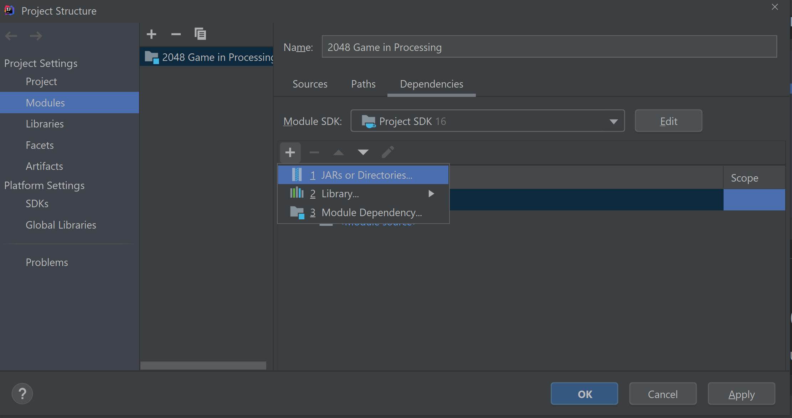
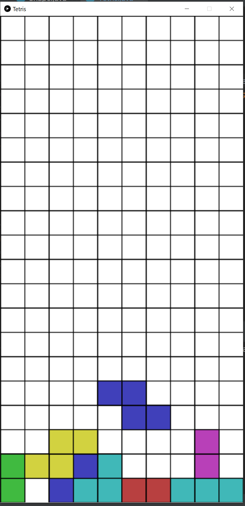

# Tetris-in-Processing
### Fully functional Tetris Game using the [Processing](https://processing.org "Processing") Java GUI Library

# Building the Game
To start the Game the core.jar and sound.jar files need to be added as dependencies, either with a build tool like Gradle or in
IntelliJ´s Project Settings.

###IntelliJ

# Controls

Use A, S, D for movement controls and P for Rotation.

## Gameplay

